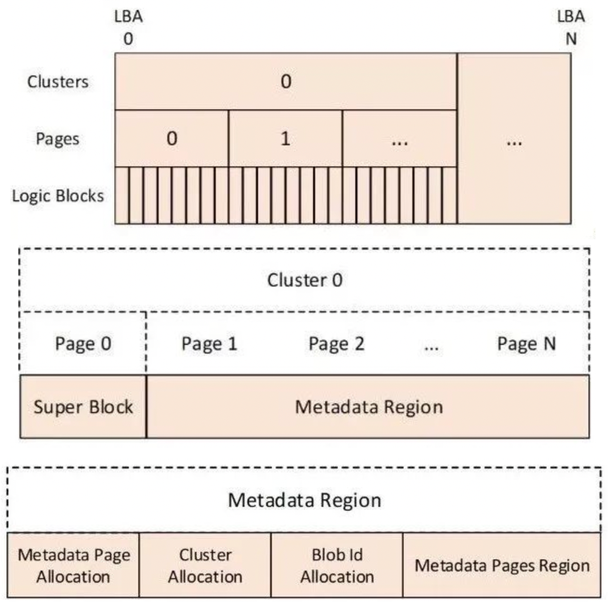
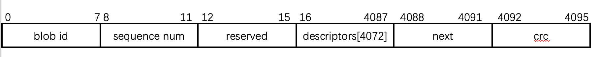
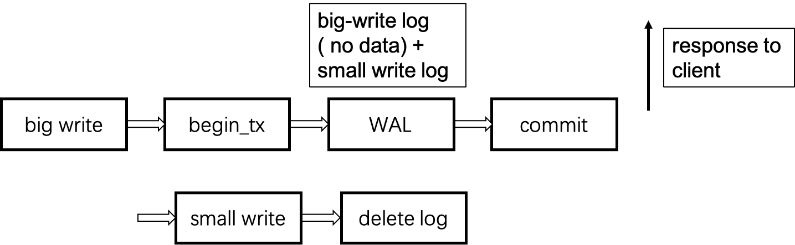
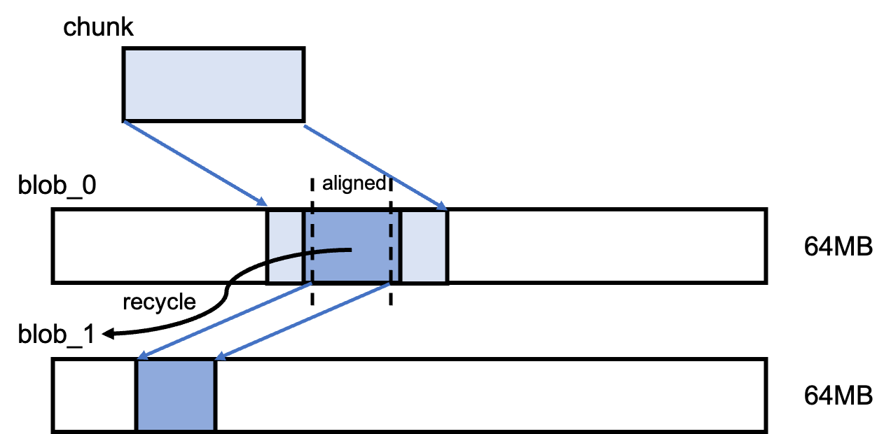

# 1 BACKGROUND

## 1.1 BlobStore

### 1.1.1 BlobStore的抽象结构

- 存储抽象层次结构

  - logic block (512B or 4KB) – page (4KB) – cluster (1MB) – blob – BlobStore

- 原子性粒度

  - 数据写入：原子性粒度是一个page，如果更新一个page的时候断电，电源恢复之后该页面与写前一致。是由底层的device保证的（Flash SSD读写粒度为一个page 4K）
  - Blob元数据更新：需要显式调用sync
  - BlobStore元数据更新：只有正确unload的时候才会进行持久化，如果中间发生错误，在下次load的时候会通过扫描所有blob的元数据来进行恢复

- Blob的管理

  - 元数据管理、遍历、空间分配（在bdev层的抽象上）

- 提供的接口：基于Blob语义的read, write, create, resize, delete

- BlobStore结构

  - 

  - cluster0是Blobstore的元数据区域（可以扩展到之后的cluster）
  - page0为super block，记录了cluster的大小、已使用page的起始位置、已使用page的个数、已使用cluster的起始位置、已使用cluster的个数、Blobstore的大小等信息
  - Metadata Page Allocation：元数据页的分配情况，指的是blob元数据页的分配情况
  - Cluster Allocation：所有cluster的分配情况
  - Blob Id Allocation：记录blob id的分配情况
  - Metadata Pages Region：每个blob的元数据页。在读写blob时，首先会通过blob id定位到该blob的元数据页，其次根据元数据页中所记录的信息，检索到对应的cluster。

### 1.1.2 Blob相关结构

- 一个Blob的元数据页磁盘数据结构

  - 

  - blob id = metadata page index | 1 <<32 ，即末32位是第一个md page的index（按页）
  - sequence num 表示“这是第几个md page”
  - descriptor：这里存了这个blob的data cluster位置等信息，以及extent_table等
  - next是下个md page的位置
  - crc校验码，对该元数据页的校验

### 1.1.3 BlobStore的部分API

- spdk_bs_init

  - 通过底层bdev提供的设备信息，或者用户配置的设备信息和自定义的参数，对blobstore进行初始化

  - clear region + write super block

- spdk_bs_load
  - 读取super block（第一页），还原blobstore的元数据
    - 读取blob的元数据域，检查有无损坏的blob，并进行fix or remove

- spdk_bs_unload
  - 写入super block

### 1.1.4 Q&A

- blob数太少？
  - The metadata region is the remainder of cluster 0 and may extend to additional clusters. ”
  - 除了第0个cluster，之后的cluster也可以用作存储blob的元数据的地方
- blobfs和blobstore对磁盘的管理情况？
  - blobfs只是对blobstore的简单封装，把文件语义转换为blob语义，没有额外管理磁盘

## 1.2 BlobFS

### 1.2.1 overview

- 没有inode结构
- 只是一个简单的把对文件的语义转换为对blob的操作语义
  - eg: create file -> create blob

- 所有操作直接依赖于BlobStore，没有对磁盘做额外管理，以块对齐写入，仅支持append
- 没有目录树结构，是个扁平的namespace
  - “BlobFS currently supports only a flat namespace for files **with no directory support**. Filenames are currently stored as **xattrs** in each blob. This means that filename lookup is an O(n) operation.”

### 1.2.2 BlobFS API

-  init, load, unload
- alloc_io_channel, free_io_channel
- file相关同步API: 
  - stat（只有size 和BlobID）, create, open, close, rename, delete
  - iter, sync, truncate, set_priority
  - write, read

- 异步API
  - read_async, write_async, state_async, write_async, read_async
  - create_file_async, open_file_async, close_async
  - rename_async, delete_async, truncate_async, sync_async

### 1.2.3 file结构

- 一个file关联一个blob
- name, length
- 一些flag（is_deleted, priotity, append_pos）
- spinlock

## 1.3 File System for Flash

- F2FS：对FTL层做了编程
- YAFFS/YAFFS2
- JFFS2

## 1.4 COW File System

- BtrFS：元数据用b-tree管理，写入新块之后修改b-tree结构

# 2 STRUCTURE

- 结构图如下，与BlueStore类似，本地chunk的元数据（用于支持必要的接口的，和write的）存在RocksDB里面
- 

- TransLayer负责把上层的chunk操作语义转换为Blob操作语义
- 尚未设计缓存

# 3 API

- create (oid, chunk_id)
- read (oid, chunk_id, buf, offset, length)
- write(oid, chunk_id, buf, offset, length) （需要保证原子性）
- remove(oid, chunk_id)

# 4 KEY OPERATION

## 4.1 write

- 参照BlueStore做法，将写请求切割为中间page对齐部分和首尾page没有对齐部分
- 

- 首尾没有基于page对齐部分执行RMW，需要写WAL（small write）
- 中间对齐部分写到新的位置（big write）

- write流程示意图如下：
- 

- 总结一次write流程：

  - 切分写操作为大写+小写

  - 执行大写：将所有的page对齐的数据写到blob的空闲位置（新位置）

  - 借助RocksDB的事务接口：

    - begin_tx
    - 记日志：
      - 修改大写涉及到的元数据（修改**位置元数据**位图）
      - 记小写的日志：数据+位置
    - 修改checksum数组

    - commit_tx

## 4.2 read

- 方案一：读缓存 ---- 读日志 ---- 读磁盘
- 方案二：将write请求返回给客户端的时间推迟到small write完成，读请求直接读缓存 ---- 读磁盘
- 方案三：read等到write请求做完再返回（write可以在commit后就返回，但是如果来读同一个东西，就得等前面的写全部做完。做完的标志是什么？日志被删除）

# 5 LAYOUT

## 5.1 thread private space

- 每个线程应该拥有自己的空闲空间，不然在分配新空间的时候会出现竞争
- 每个线程初始分配一个大的blob作为自己的空闲空间（Ceph是64MB），不够了继续申请
- layout：之前是一个chunk一一对应一个blob；现在一个chunk可能对应多个blob，一个blob也可能包含多个chunk
- 读不受影响，chunk_id -> { blob_id + offset }
- COW策略：每个线程把需要大写的部分写到自己的空闲空间中，小写保持原来位置
  - 这时候原来的对齐的大写空间如何回收？原来的空间回收给这次写操作的线程空间
  - 带来的问题：在频繁的写的情况下，每个线程的空间会越来越不平衡，需要另外考虑做GC
  - 线程只能从自己的空间allocate（大写），但是可以写其他线程的空间（小写）

## 5.2 layout change

- 一个可能的初始的layout如下图
- 

- 一个chunk最开始被线程i写到了blob_0的某个区域（可能不连续）
- 经过一次write操作后，可能的layout如下图
- 
- **位置元数据**：记录的是一个chunk逻辑page位置到实际在blob中的page位置的映射。
  - eg. 最开始写入了一个chunk：Blob0, page 1,2,3,4...... 100
  - 下一次对2,3,4执行了覆盖写，此时page3可能到了Blob1的page101
- 一个thread_local的结构，需要维护：该线程拥有的空闲空间列表（BlobID+page[]，因为可能从别的线程处拿到新的空闲空间）
  - 空闲空间为什么由新的线程获得了，而不是归原来的线程？原来的线程是不会分配这部分空间的，因为在旧线程眼中这部分空间不是空闲的。

# 6 CRASH RECOVERY

- 保证每次WAL是否完整写入，怎么保证完整写入？ ----> RocksDB保证
- 写策略在WAL写入RocksDB就返回给上层，后台线程将WAL apply到磁盘上，当apply到磁盘上之后，就会删掉这个WAL
- crash后重启，将RocksDB内所有没有删除的WAL重做（涉及到搜索所有WAL）
  - 怎么保序？每条WAL应该加上一个序号，atomic计数器 / RDTSC / RDTSCP/（不同核时钟有偏差）/ ORDO

# 7 CONCURRENT ROCKSDB

- RocksDB的操作是线程安全的，支持多线程并发写入

- 内部会将多个并发的写任务串起来

- > rocksdb的每次写入都以一个WriteBatch对象为载体，WriteBatch记录了要写入的所有数据。
  >
  > rocksdb将每个将要写入的WriteBatch对象封装为一个Writer对象，其中记录了：
  >
  > - 本次write的wal配置，比如是否要做sync，要写入的wal日志编号等等
  > - 本次要write的数据，即**WriteBatch**对象
  > - 本次write所属的write group
  > - 本次write的第一个数据对象的SN(Sequence Number)
  > - 前置writer
  > - 后置writer
  >
  > 因为数据库系统随时都会有接连不断的写请求涌入，为了处理并发，rocksdb将多个writer对象用链表串起来，组成一个WriteGroup, 一个WriterGroup会选出一个leader来管理当前group的写过程。而任意时刻只会有一个WriteGroup被写入。
  >
  > https://zhuanlan.zhihu.com/p/369384686

- > **Q: Can I write to RocksDB using multiple processes?**

  > A: No. However, it can be opened using Secondary DB. If no write goes to the database, it can be opened in read-only mode from multiple processes.

- 多个线程向RocksDB写同一个对象的WAL，后写的成功，先写的失败 ------- 

# 8 CHECKSUM

## BlueStore Checksum

- BlueStore的checksum算法采用的是crc32算法，对固定大小的数据块计算checksum，数据块的大小的大小一般为4K
- checksum作为BlueStore_blob_t结构体序列化的一部分存储在数据库中。e.g. 一个64KB的blob，做crc32checksum，一个数据块需要4字节，那么这个blob有(64KB/4KB)*4B=64字节的checksum
- 每次对齐写和非对齐写都要以数据所在的4KB数据块为单位计算checksum，不满的填充0，计算出的checksum保存在blob元数据中，用数组的形式，第i个元素对应第i个数据块的checksum
- 读数据：
  - 查找读取的数据区间对应的checksum数组，读取数据之后按块计算checksum
- BlueStore中五个操作会涉及到读取数据，涉及校验
  - fsck：mount的时候会做fsck，扫描所有对象元数据（必须）、数据（可选项）
  - clone：clone对象
  - read：发现错误的时候会主动进行修复，向上报告就行
  - write：对于RMW部分，发现错误会进行标记，abort事务；对齐部分按4K计算校验和，放在RocksDB
  - gc
- BlueStore里面限制了blob的大小（BlueStore的逻辑结构是：onode -> extent/blob -> pextent）为512KB，因此一个blob的checksum最大为512B

# 9  CACHE

- suStore: https://github.com/madsys-dev/SuStore
- 

# 10 ERROR

- 返回错误类型
- 实现路径（每个模块+测试）

- 日志合并

