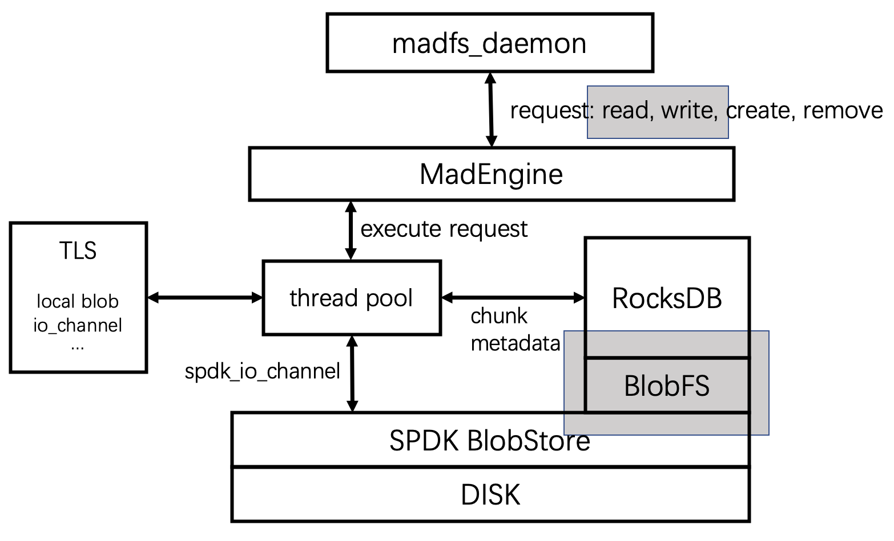

This is record file for RocksDB + SPDK integration.

- configure spdk with `./configure --with-fuse`, todo: change async-spdk build file
- to make RocksDB db_bench, remember to use `export USE_RTTI=1`, in order to avoid some undefined problems
- use `make db_bench SPDK_DIR=../spdk`, this means rocksdb and spdk should be in the same dir
- a Malloc0 configuration file is now in `/usr/local/etc/spdk/rocksdb.json
- to integrate BlobFS to RocksDB:
    - first: `./test/blobfs/mkfs/mkfs /usr/local/etc/spdk/rocksdb.json Malloc0`, to create blobfs on bdev called Malloc0
    - second: `./test/blobfs/fuse/fuse /usr/local/etc/spdk/rocksdb.json Malloc0 /mnt/fuse`, use fuse plug-in to mount blobfs on bdev Malloc0, *now, stuck here*
- to test rocksdb db_bench, use:
    - ./db_bench -spdk /usr/local/etc/spdk/rocksdb.json -spdk_bdev Malloc0 -spdk_cache_size=1024 --benchmarks="readrandomwriterandom,stats" --num=10000 --db=./db_bench_test --wal_dir=./db_bench_test
- whenever some dependency changes when doing rocksdb db_bench, use `make clean`, and make again
- a blog [从SPDK Blobstore到 Blob FS](https://blog.csdn.net/weixin_37097605/article/details/124977125?spm=1001.2101.3001.6650.1&utm_medium=distribute.pc_relevant.none-task-blog-2%7Edefault%7ECTRLIST%7Edefault-1-124977125-blog-119154739.pc_relevant_default&depth_1-utm_source=distribute.pc_relevant.none-task-blog-2%7Edefault%7ECTRLIST%7Edefault-1-124977125-blog-119154739.pc_relevant_default&utm_relevant_index=2) introduce an RPC style to create and mount blobfs

## 0623 record - test RocksDB db_bench on BlobFS
Mount BlobFS and run RocksDB db_bench in the mount dir
- create a memory-based bdev using spdk-rpc
    - `./build/bin/spdk_tgt` (another terminal, shut down this process, and BlobFS will automatically unmounted withour extra effort)
    - `./scripts/rpc.py bdev_malloc_create 512 4096`, create a memory-based bdev with size 4096 MiB(?), remember to reserve enough huge memory if "mempool creation fail" error happens.
    - `./scripts/rpc.py blobfs_create Malloc0`, create BlobFS on bdev above, named Malloc0
    - `./scripts/rpc.py blobfs_mount Malloc0 /mnt/fuse`, mount BlobFS to dir /mnt/fuse
    - `$ROCKSDB_DIR/db_bench --benchmarks="readrandomwriterandom,stats" --num=10000000 --db=/mnt/fuse --wal_dir=/mnt/fuse`, use RocksDB db_bench and test random read and write in the mounted dir

Problem about fuse test mentioned above remain unsolved.

- dependencies:
    - fuse3

## 0630 record

- SPDK提供的RocksDB版本似乎已经集成了blobfs，只需要把RocksDB和SPDK放在同一目录下

> 当前，由SPDK团队提供的RocksDB，会在内部自行启动一个 SPDK 环境

- 需要一个统一的SPDK执行环境
  - 运行RocksDB的blobfs和存储数据的blobstore会各自启动一个SPDK环境
  - 因此需要一个统一的管理模块

- 整体结构和目前进度：
- 
- [x] 整体结构，为上层提供一个handle，拿到一个handle之后即可调用read, write, create, remove
- [x] 创建线程池，初始化每个线程的thread local变量，包括每个线程的私有blob和空闲空间位图
- [x] create：在RocksDB中创建一个空的chunk后返回
- [x] remove：移除RocksDB中的元数据，todo：回收空闲空间
- [ ] read
- [ ] write
- [ ] 统一的SPDK运行环境

## 0707 record
- [x] add error handle part 
- [x] create
- [x] remove
- [x] read, write, basic logical implementation
- [x] update thread pool implementation
- [ ] todo: function test

